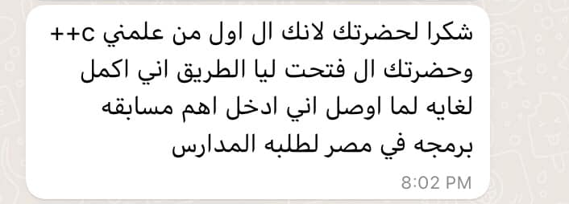

# 🚀 Mastering Basics in C++ for Beginners

*A beginner-friendly guide to learning C++ from scratch. Build a strong foundation with clear explanations, hands-on examples, and practical projects.*

  **Under Development**

## 📸 A Success Story.

**Youssef started learning C++ with me from scratch. Despite being in middle school, he showed incredible enthusiasm, stayed for full sessions, and kept pushing forward. Thanks to his effort and early mentorship, he won the prestigious Al-Quds coding competition, earned a scholarship from the Egyptian Ministry of Communications, and qualified for the National Olympiad in Informatics. I’m truly proud to have been part of his journey. He reminds us that early encouragement can unlock greatness.**

**View all of Youssef’s messages expressing his appreciation:** [Youssef Feedback](./Success-Story.md)

## 📸 **Highlights from** Free Live Book Sessions.

See all the session photos and feedback here 👉 [Session Highlights](./feedback.md)

## 📖 Book Overview

This book is the result of intense effort, dedication, and daily work. It teaches C++ fundamentals through step-by-step guidance, real-world examples, and beginner-friendly language. It’s designed for learners with little or no programming experience.

> 📚 Run all code examples in Visual Studio to see output live.

## 📅 Table of Contents

- [Book Content](./source/chapters.md)
- [Key Features](#-key-features)
- [Who Should Read This?](#-who-should-read-this)
- [What You'll Save](#-what-you-will-save)
- [Real-World Applications](#-real-world-applications)
- [Author Bio](#-about-the-author)
- [References](#-references)

## 📂 Resources

- [📜 License & Legal Notice](./CODE_OF_CONDUCT.md)
- [🤝 Contribution Guide](./CONTRIBUTING.md)

## 🎯 Key Features

- **Zero to Hero:** Start with "Hello World" and progress to clean, efficient code
- **Modern Standards:** Covers best practices
- **Hands-On Learning:** 50+ exercises and projects
- **Free & Open Source:** No paywalls, forever

## 👩🎓 Who Should Read This?

- Absolute beginners in programming
- CS students needing C++ fundamentals
- Developers seeking a structured refresher

**Requirements**
- A computer (Windows/macOS/Linux)
- Basic understanding of math and English

## ⏳ What You Will Save

- **Time:** Skip fragmented tutorials
- **Money:** Free alternative to paid courses
- **Effort:** Gain practical, industry-relevant skills

## 🌍 Real-World Applications

- File I/O and formatting
- Debugging and error handling
- Menu systems and input validation
- Object-oriented design with UML
- Simulation and project-based learning

## 🚀 Continuous Integration and Branch Protection

This repository employs GitHub Actions for Continuous Integration (CI) to ensure that all code changes meet our quality standards before being merged into the main branch. 

### 🔄 Continuous Integration with GitHub Actions

Our CI pipeline is defined using GitHub Actions workflows, which automate the building and testing of code changes. This automation helps in early detection of issues and maintains the integrity of our codebase. 

## 🔒 Security Best Practices (GHAS Compliant)

This repository follows **GitHub Advanced Security** principles:

- ✅  **Secret scanning enabled**
- ✅  **Code scanning setup with GitHub Actions**
- ✅  **Security advisories & policies available**
- ✅  **Community health files present (README, LICENSE, CODE_OF_CONDUCT, etc.)**

Please report any vulnerabilities through the [`SECURITY.md`](./SECURITY.md) policy.

## ✍️ Contribution Guidelines

You're welcome to improve grammar, format chapters, or add code examples. Read our [CONTRIBUTING.md](./CONTRIBUTING.md) for details.

## 📦 Managing Large Files with Git LFS

This repository utilizes [Git Large File Storage (LFS)](https://git-lfs.github.com/) to handle large files efficiently.

## 📚 References

- Aditya Bhargava. *Grokking Algorithms*, Manning.
- Tony Gaddis. *Starting Out with C++*, 8th ed., Addison-Wesley.
- Robert Lafore. *Object-Oriented Programming in C++*, Techmedia.
- Adam Drozdek. *Data Structures and Algorithms in C++*, 4th ed., South-Western.
- D.S. Malik. *Data Structures Using C++*, 2nd ed., Cengage.
- Thomas H. Cormen. *Introduction to Algorithms*, MIT Press.

## 👨‍💻 About the Author

I am a **Senior DevOps Engineer** with 10+ years of experience in cloud automation, infrastructure as code (IaC), and CI/CD pipeline optimization. My expertise lies in building, and securing scalable cloud environments using **Terraform**, **Kubernetes**, and **GitHub Advanced Security** across **Azure** and **AWS**.

### 🚀 Key Achievements

- ⚙️ Reduced deployment time by 50% through advanced CI/CD automation and IaC
- 💰 Optimized cloud costs by 40% through efficient scaling strategies
- ☸️ Built and managed high-availability Kubernetes clusters (AKS & EKS) with Terraform & Helm
- 🛡️ Designed enterprise-scale DevOps architectures with security-first, automation-driven approaches

### 💡 What I’m Passionate About

- **Driving Innovation:** Improving efficiency, security, and reliability
- **Mentoring & Knowledge Sharing:** Helping engineers grow and succeed
- **Automation & Cloud Optimization:** Implementing smart, scalable infrastructure

## 📩 Stay Connected

Follow the author:
- Gamil: [engineerwahba@gmail.com](mailto:engineerwahba@gmail.com) | LinkedIn: [LinkedIn](https://www.linkedin.com/in/wahbamousa/)

---

> **Thank you for being part of this journey. Let’s keep learning and building together!**

© 2025 Wahba Mousa

---