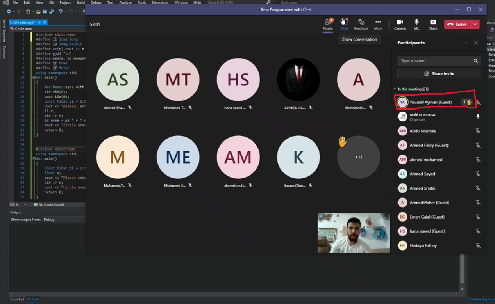
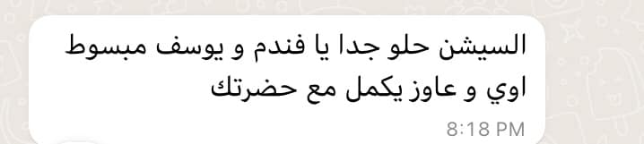
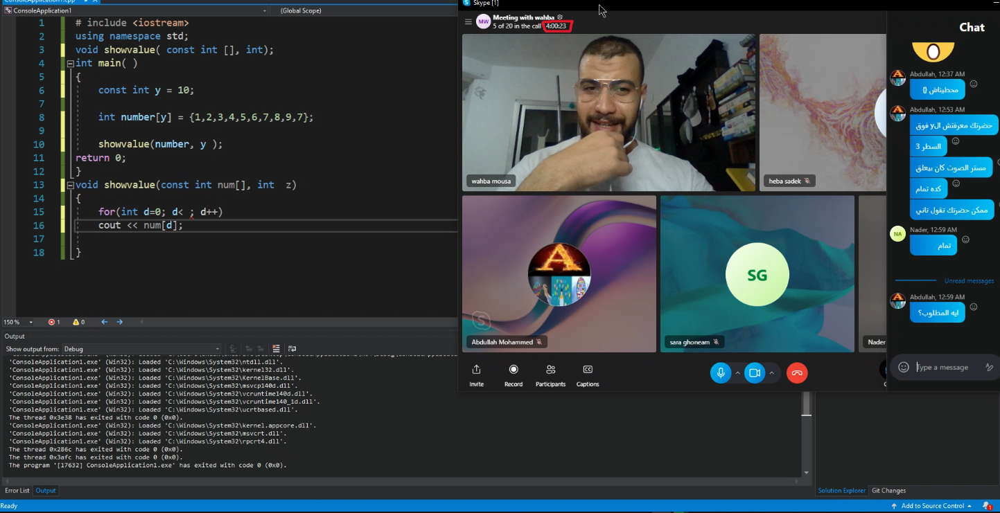

## 📸 Youssef Success Story.

## A pro active student

## Youssef was clearly engaged and excited.

## Youssef’s parent shares that he Won the Al-Quds Competition in Egypt, Was awarded a Ministry of Communications scholarship to study C++ at the Arab Academy and Qualified for the Egyptian Olympiad in Informatics.

## Youssef believ he could aim high.

**I’m very proud of Youssef — he was proactive and stayed with me until the end of every session, which lasted nearly 4 hours.**

## 📸 Highlights from this Book **Free** Live Sessions in Action.

See all the session photos and feedback here 👉 [Session Highlights](./feedback.md)
