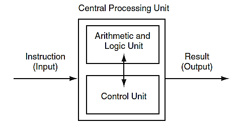
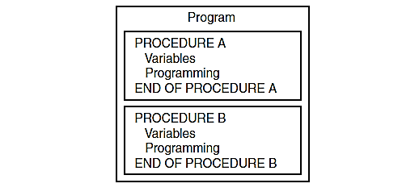
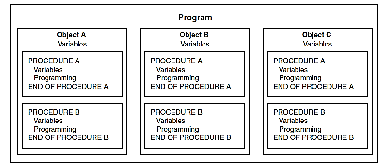

# CH. (1) Introduction to Computer and Programming

## What, Where, and Why Programming?

-   Programming is a set of software instructions stored in a computer’s memory. The computer follows these instructions to perform tasks. These tasks are written in various programming languages. However, the computer understands only one language—**binary code (0 and 1)**—which represents on/off or true/false states. A compiler translates human-readable languages into binary code.
    
-   Programming is found in smart TVs, phones, watches, washing machines, cars, laptops, and many other devices. These devices follow programs to execute tasks and make life easier.
    
-   Computers can perform multiple tasks simultaneously such as sending emails, writing documents, controlling systems, navigating, and supporting sectors like business, agriculture, medicine, government, and entertainment.
    

## How Does a Program Tell a Computer to Solve a Problem?

**Example: Calculate the area of a square**

1.  Display a message asking for the square’s length.
    
2.  Wait for the user to enter the length, then store it in memory.
    
3.  Multiply the length by itself (length²) and store the result.
    
4.  Display the area stored in memory.
    

This list of instructions is called an **algorithm**. These steps must be followed in order. The CPU processes only instructions written in **machine language** (e.g., `01101`). Programming languages like C++ use words instead of numbers to make coding easier, and tools like Visual Studio translate this into machine code.

## Is Learning Programming Mandatory or Optional?

**Mandatory** – Learning programming helps you gain valuable skills that would take years and significant cost to develop otherwise.

## Programming Benefits

1.  Attention to detail
    
2.  Organization
    
3.  Structured thinking
    
4.  Patience
    
5.  Strategic planning
    
6.  Problem-solving skills
    
7.  Mental stimulation
    
8.  Career opportunities
    
9.  Confidence in your abilities
    
10.  Improved understanding of human behavior
    
11.  Daily intellectual exercise
    

## The Right Age to Learn Programming

There is **no specific age**. A 5-year-old child may learn several programming languages, while an adult in their thirties might begin with curiosity and a PlayStation game. Success in programming depends on **desire, ambition, and intelligence**, not age.

## Programming Requirements

-   Ambition
    
-   A computer that can be turned on and off
    
-   Basic English knowledge
    
-   Internet access
    
-   Familiarity with the multiplication table
    

## Most Popular Programming Specialties

1.  Game Apps
    
2.  Internet Websites
    
3.  Mobile Apps
    
4.  Databases
    
5.  Cybersecurity
    
6.  Artificial Intelligence
    
7.  Machine Learning
    
8.  Deep Learning
    
9.  DevOps
    

## Difference Between Programming and Programming Languages

Programming languages are **tools** used to write programming code. Just like tires are not the entire car but part of it, programming languages help build software—but it’s the **problem-solving ability** that matters most.

----------

## Computer System

A computer system consists of **hardware** and **software**.

### Hardware

Includes physical components such as:

-   Central Processing Unit (CPU)
    
-   Main memory
    
-   Secondary storage (e.g., RAM, hard drives)
    
-   Input and output devices
    

----------

## CPU (Central Processing Unit)

The CPU consists of two main parts:

-   **Control Unit (CU)** – Determines the next instruction and coordinates activities with control signals.
    
-   **Arithmetic and Logic Unit (ALU)** – Performs mathematical and logical operations.
    

When the CPU executes a program, it goes through the **Fetch–Decode–Execute** cycle:

1.  **Fetch** – Control unit retrieves the next instruction from memory
    
2.  **Decode** – The instruction is decoded into an electronic signal
    
3.  **Execute** – Signal is sent to the appropriate component (e.g., disk drive) to perform an operation
    

These steps repeat as long as instructions remain.

----------

## Computer Memory

-   Memory is divided into tiny storage locations called **bytes**.
    
-   Each byte contains 8 **bits** (binary digits: 0 or 1), acting like switches (on = positive, off = negative).
    
-   Every byte has a unique address.
    

----------

### Main Memory (RAM)

-   Also called **primary** or **volatile** memory.
    
-   Temporarily stores programs and data while they are running.
    
-   Content is lost when the computer is powered off.
    

----------

### Secondary Storage

-   Stores data **long-term**, even without power.
    
-   Examples: Hard drives, USB drives, CDs, DVDs.
    

----------

### Input Devices

Collect and send information to the computer. Examples:

-   Keyboard
    
-   Mouse
    
-   Microphone
    

----------

### Output Devices

Display or output data from the computer. Examples:

-   Monitor
    
-   Printer
    
-   Speaker
    

----------

## Software Types

### 1. System Software

Controls the basic operations of the computer:

-   **Operating System (OS)**: Manages hardware and devices, allows other programs to run
    
-   **Utility Programs**: Perform special tasks like virus scanning, file compression, backups
    
-   **Development Tools**: Create, test, and modify software (e.g., Visual Studio)
    

### 2. Application Software

Programs used for daily tasks, such as:

-   Word processors
    
-   Presentation tools (e.g., PowerPoint)
    

----------

## Programming Languages

-   **Low-Level Languages**: Closer to machine code (e.g., binary)
    
-   **High-Level Languages**: Closer to human language (e.g., C++, Java)
    

C++ is a combination of both low- and high-level languages. It does not manage memory automatically and works across different systems (e.g., Windows, macOS).

----------

## Program Structure

-   **Source Code**: Instructions written by the programmer
    
-   **Source File**: The file where the code is saved
    

----------

## Program Cycle

1.  **Write code** → translating to machine language → first phase of program translating called → preprocessor.
    
2.  **Preprocessing** – Handles special lines starting with `#` that do some changes on source code → next phase preprocessor search for any syntax error.
    
3.  **Syntax Check** – Compiler checks for errors.
    
4.  If no errors, code is translated to **object code** in object file (although object file contains machine language it isn’t complete program. here is why: C++ has library of prewritten code for difficult tasks called run-time library) → during last phase of translation process, another program called linker.
    
5.  **Linker** – Combines object code with libraries to produce an **executable file**
    

----------

## Program Components

1.  **Keywords** – Reserved words (always lowercase)
    
2.  **Identifiers** – Names of variables (e.g., `age`, `name`)
    
3.  **Operators** – Perform operations (e.g., `=`, `*`, `<`, `>`)
    
4.  **Punctuation** – Marks statement boundaries (e.g., `;`)
    
5.  **Syntax** – Rules for writing code
    
6.  **Statements** – Instructions that perform actions
    
7.  **Lines** – May be blank (for readability) or meaningful
    
8.  **Variables** – Named memory locations (e.g., in RAM)
    
9.  **Variable Definitions** – Declare the type and create memory space (e.g., for numbers or characters)
    

----------

## Program Activities

### A Program Follows Three Main Steps:

1.  **Input** – Gather data from the user
    
2.  **Process** – Operate on the data
    
    -   a. Define the program's purpose
        
    -   b. Design the program using tools:
        
        -   **Hierarchy Chart** – Shows the program structure
            
        -   **Flowchart** – Shows the logical sequence
            
        -   **Pseudocode** – Text version of an algorithm
            
    -   c. Check for logical errors
        
    -   d. Type, save, and compile the code
        
    -   e. Debug errors during testing
        
    -   f. **Desk-checking** – Manually review logic before execution
        
    -   g. Run the program with test input and verify results
        

#### Validating User Input

A good program checks for:

-   Numbers within a valid range (e.g., ≤ 168 hours/week)
    
-   Valid item selections
    
-   Invalid values (e.g., division by zero)
    

3.  **Output** – Display results to the user
    

----------

## Software Engineering

The process of developing software, including:

-   Designing
    
-   Writing
    
-   Testing
    
-   Debugging
    
-   Modifying
    
-   Maintaining software systems
    

----------

## Procedural vs Object-Oriented Programming

### Procedural Programming

Uses **functions or procedures**, which are groups of statements performing specific tasks. Procedures can share variables.

### Object-Oriented Programming (OOP)

Uses **objects**, which contain **data** and **methods**. This approach promotes **code reuse** and better organization.

