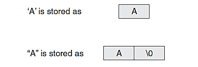

# CH. (2) Introduction to C++

## C++ Special Characters

1.  `//` Double forward slash: Marks a comment. The compiler ignores everything from the `//` to the end of the line.
    
2.  `#include <iostream>`: The `#include` directive tells the preprocessor to include the contents of another file. `iostream` is a header file that provides functionality for input/output using `cout` and `cin`.
    
3.  `using namespace std;`: C++ uses namespaces to organize program entities. This line allows the program to use elements from the `std` namespace, such as `cout`.
    
4.  `()` Parentheses: Used to define function calls, e.g., `int main()`.
    
5.  `int main()`: The entry point of every C++ program. `int` indicates the function returns an integer value to the operating system upon completion.
    
6.  `{}` Braces: Enclose a group of statements, such as the contents of a function.
    
7.  `{` Left brace: Begins the main function.
    
8.  `""` Quotation marks: Enclose strings, e.g., messages to be printed.
    
9.  `;` Semicolon: Marks the end of a complete statement.
    
10.  `cout << " "`: Sends output to the console. Text is printed without quotation marks. Use `<<` (stream insertion operator) to send output. To print a new line, use `endl` or `\n`. Avoid spaces between the backslash and character in escape sequences (e.g., `\n`).
    
11.  `return 0;`: Indicates successful completion of the program.
    
12.  `}`: Marks the end of the `main` function.
    

## Common Escape Sequences

Escape Sequence   Name              Description
----------------- ---------------- ------------------------------------------
' '               Space             Regular space
\n                Newline           Move cursor to next line
\t                Horizontal tab    Skip to next tab stop (~8 spaces)
\a                Alarm             Makes the computer beep
\b                Backspace         Moves cursor left
\r                Return            Moves cursor to beginning of line
\\                Backslash         Prints backslash
\'                Single quote      Prints single quote
\"                Double quote      Prints double quote
\x                Hexadecimal       E.g., \x74 prints character 't'


Hexadecimal notation, e.g., `cout << "\x74";` prints character `t`

**Note**: `\n` is equivalent to `"\n"`.

## Bitwise Operators

It works on bit.
-----------------
-   `&` AND    
-   `|` OR
-   `^` XOR (exclusive OR)
-   `~` NOT (complement)
-   `<<` Shift bits left
-   `>>` Shift bits right

## Mathematical Expressions and Operator Precedence

Mathematical expressions return values, e.g., `sum = 21 + 3;`. Operators are evaluated left to right, and precedence determines the order:

**Precedence of Arithmetic Operators (Highest to Lowest):**

1.  `()` Parentheses
    
2.  `* / %`
    
3.  `+ -`
    

**Operator’s associativity of same precedence:**

-   `* / %` -> Left to Right
    
-   `+ -` -> Left to Right
    
**Grouping with Parentheses:** parts of mathematical expression may be grouped with parentheses to force some operations to be performed before others.     

**Example**: `(5 + 2) * 4 = 28`

### Algebraic to C++ Conversion Examples

Algebraic Expression            Operation             C++ Equivalent
----------------------------    -------------------   -------------------------------
(3)(12)                         3 times 12            3 * 12
Y = 3x / 2                                            y = x / 2 * 3; or 3 * x / 2;
a = (3x + 2) / (4a - 1)                               a = (3 * x + 2) / (4 * a - 1)
average = a + b + c / 3.0     ← incorrect             Wrong!
average = (a + b + c) / 3.0   ← correct               ✅ Correct


## Data Type Ranking (Highest to Lowest)

Rank  Data Type
----- --------------------------
1     long double
2     double
3     float
4     unsigned long
5     long
6     unsigned int
7     int
    
When operator’s operands are of different data types, C++ automatically convert them to same data type. this can affect results of mathematical expressions. this automatic conversion is known as type coercion. when value is converted to higher data type, it is said to be promoted. to demote value means to convert it to a lower data type. look at specific rules that govern evaluation of mathematical expressions.    

**Type Coercion Rules:**

1.  `char`, `short`, and `unsigned short` -> promoted to `int`
    
2.  Lower-ranking operand is promoted to higher-ranking operand
    
3.  Final expression result is converted to the receiving variable type
    

## Data Type Operations

Operand Types                  Result Type
----------------------------   -----------------
int (+ - * /) int              int
int (+ - * /) float            float
int/float with double          double
    

## C++ Operator Precedence Table

Level  Precedence Group           Operator(s)                   Description                         Grouping
-----  -------------------------- ----------------------------- ---------------------------------- -------------
1      Scope                      ::                            Scope qualifier                    Left-to-right
2      Postfix (unary)            ++  --  ()  []  .  ->         Postfix inc/dec, call, subscript   Left-to-right
3      Prefix (unary)             ++  --  ~  !  +  -  &  *       Prefix ops, deref, logic/bit not   Right-to-left
                                 new  delete sizeof (type)      Allocation, size, typecast
4      Pointer-to-member          .*  ->*                        Member pointer access              Left-to-right
5      Arithmetic: scaling        *  /  %                        Multiply, divide, modulo           Left-to-right
6      Arithmetic: addition       +  -                           Addition, subtraction              Left-to-right
7      Bitwise shift              <<  >>                         Shift left, shift right            Left-to-right
8      Relational                 <  >  <=  >=                   Comparisons                        Left-to-right
9      Equality                   ==  !=                         Equality / inequality              Left-to-right
10     Bitwise AND                &                              Bitwise AND                        Left-to-right
11     Bitwise XOR                ^                              Bitwise exclusive OR               Left-to-right
12     Bitwise OR                 |                              Bitwise inclusive OR               Left-to-right
13     Logical AND                &&                             Logical AND                        Left-to-right
14     Logical OR                 ||                             Logical OR                         Left-to-right
15     Assignment / ternary       =  +=  -=  *=  /=              Assignment                         Right-to-left
                                 %=  >>=  <<=  &=  ^=  |=  ?:   Compound assign, ternary
16     Sequencing                 ,                              Comma separator                    Left-to-right


## Variables and Literals

-   A variable is RAM storage location. literal is constant value are assigned to variable. variable’s definitions end with semicolon like int number = 5; =assignment is operator that copies value on its right (5), this line does not print anything. it runs silently storing value in RAM.
**Note:** string number = "5"; isn’t integer, but string literal. because number was defined as string variable.

    
-   A literal is a constant value (e.g., `"5"` is a string literal)
    
    Literal                        Type
----------------------------   ------------------
20, 0                         Integer literal
"bushels of apples.\\n"       String literal

## C++ Keywords

alignas        const            for              private          throw
alignof        constexpr        friend           protected        true
and            const_cast       goto             public           try
and_eq         continue         if               register         typedef
asm            decltype         inline           reinterpret_cast typeid
auto           default          int              return           typename
bitand         delete           long             short            union
bitor          do               mutable          signed           unsigned
bool           double           namespace        sizeof           using
break          dynamic_cast     new              static           virtual
case           else             noexcept         static_assert    void
catch          enum             not              static_cast      volatile
char           explicit         not_eq           struct           wchar_t
char16_t       export           nullptr          switch           while
char32_t       extern           operator         template         xor
class          false            or               this             xor_eq
compl          float            or_eq            thread_local

Keywords must be lowercase (e.g., `int`, `return`, `for`, `while`...)

## Legal Identifiers

Here are some specific rules that must be followed with all identifiers:

-   Must begin with a letter or underscore
    
-   Can contain digits (not at the start)
    
-   Are case-sensitive
    

**Examples:**

Identifier           Validity        Reason
-------------------  -------------   --------------------------------------
dayOfWeek            Legal           Follows all rules
3dGraph              Illegal         Cannot start with a digit
employee_num         Legal           Uses only letters, digits, underscores
June1997             Legal           Starts with a letter
Mixture#3            Illegal         '#' is not allowed


## Integer Data Types

Variables are classified according to their data type, which determines kind of information that may be stored in them. integer variables only hold whole numbers. numeric data types are broken into two additional categories: integer and floating point. integers are whole numbers like 12, −34, floating point numbers have decimal point, like 23.0, 189.0231.

Data Type              Size       Range
---------------------  ---------  ----------------------------------------------
short int              2 bytes    -32,768 to 32,767
unsigned short int     2 bytes    0 to 65,535
int                    4 bytes    -2,147,483,648 to 2,147,483,647
unsigned int           4 bytes    0 to 4,294,967,295
long int               4 bytes    -2,147,483,648 to 2,147,483,647
unsigned long int      4 bytes    0 to 4,294,967,295
long long int          8 bytes    ±9,223,372,036,854,775,807
unsigned long long     8 bytes    0 to 18,446,744,073,709,551,615

**Note:** you can delete int word in variable definition in all except reminding it (int) only.

## Hexadecimal and Octal Literals

Programmers commonly express values in numbering systems other than decimal (base 10). hexadecimal (base 16) and octal (base 8) are popular.

-   Octal: Base 8 (digits 0–7), e.g., `0137`
    
-   Binary: Base 2 (digits 0–1), e.g., `0101`
    
-   Decimal: Base 10, e.g., `259`
    
-   Hexadecimal: Base 16 (digits 0–9 and A–F), e.g., `0xA59C`

**Note:** 
you will not be writing programs for some time that require this type of manipulation. you may find yourself reading programs that use items long integer, hexadecimal, or octal literals.     

## `char` Data Type

-   Is used to store individual characters in memory as numeric code by single quotation marks, and uses 1 byte of memory, e.g., `char letter = 'g';` each character is assigned unique number.
    
-   method for encoding characters is ASCII, which stands for American Standard Code for Information Interchange. (There are other codes, as EBCDIC used by IBM.).
    

## Strings vs. Characters

Strings are series (array) of characters stored in consecutive memory locations, in C++ extra byte is appended to end of string literals when they are stored in memory. in last byte, number 0 is stored. it is called null terminator or null character, and it marks end of string like string literal "Wahba" would be stored. W a h b a \0. quotation marks aren’t stored with string. they are simply way of marking beginning and string end in your source code. although string " Wahba " is 5 characters long, it occupies 6 memory bytes. null terminator sits quietly in background not printed. 

-   Character literal: `'A'` → 1 byte
    
-   String literal: `"A"` → 2 bytes (`'A'` + null terminator `\0`)
    
    
    
    

## `string` Class

-   First step in using string class is to include string header file, preprocessor directive: `#include <string>`
    
-   Next is to define string type variable, called string object. Example: `string movieTitle = "Fury Wheels";`
    

## Floating-Point Data Types

Floating-point data types are used to define variables that can hold real numbers, including fractional values such as `47,281.97`. In **scientific notation**, this number is written as `4.728197 × 10⁴`. The **mantissa** is the first part of the number (`4.728197`), and it's multiplied by a power of ten.

In **E notation**, `47,281.97` would be represented as `4.728197E4`. This format is useful when working with extremely large or small numbers. In memory, a floating-point number is stored using the mantissa and the power of 10.

### Examples

| Decimal Notation | Scientific Notation | E Notation |
|------------------|---------------------|------------|
| 247.91           | 2.4791 × 10^2       | 2.4791E2   |
| 0.00072          | 7.2 × 10^-4         | 7.2E-4     |

### C++ Floating-Point Types

C++ provides three data types for representing floating-point numbers:

| Data Type             | Keyword       | Description                                              |
|-----------------------|---------------|----------------------------------------------------------|
| Single precision      | float         | 4 bytes. Range: ±3.4E-38 to ±3.4E38                      |
| Double precision      | double        | 8 bytes. Range: ±1.7E-308 to ±1.7E308                    |
| Long double precision | long double   | Usually 8 bytes*. Some compilers use 10 bytes for wider range |

### Example

```cpp
float distance = 1.495979E11;
double mass = 1.989E30;

```

Note: In source code, literals like `1.495979E11` and `1.989E30` may be printed as `1.49598e+011` and `1.989e+30`. These are equivalent.

All of the following are equivalent:

```
1.4959E11
1.4959e11
1.4959E+11
1.4959e+11
149590000000.00

```

### Forcing Literal Type in C++

-   Append `F` or `f` for `float`: `1.2F`
    
-   Append `L` or `l` for `long double`: `1034.56L`
    

The compiler won’t confuse these with long integers because they contain decimal points.

## Assigning Floating-Point to Integer

When assigning a floating-point value to an integer variable, the **fractional part is discarded** (this is called truncation).

```cpp
int i;
float f = 7.5;
i = f;  // i becomes 7

```

If the whole number is too large for the integer variable, an invalid value may be stored.

## Boolean Data Type

The `bool` data type holds one of two values: `true` or `false`. In memory, this is typically stored as `1` (true) or `0` (false). It only requires **one bit** of memory.

#### Flags

A flag is a `bool` variable used to signal whether a condition exists.

```cpp
bool x = false;  // condition does not exist

```

#### Integer as Boolean

Integer variables can also act as flags:

```cpp
int x = 0;  // false
int y = 1;  // true (non-zero values are treated as true)

```

## Determining Size of a Data Type

You can use the `sizeof` operator to determine the size (in bytes) of any data type.

### Example

```cpp
#include <iostream>
using namespace std;

int main() {
    long double apple;
    cout << "Size of an integer is " << sizeof(int) << " bytes.\n";
    cout << "Size of a long integer is " << sizeof(long) << " bytes.\n";
    cout << "An apple can be eaten in " << sizeof(apple) << " bytes!\n";
    return 0;
}

```

## Variable Assignment and Initialization

Assigning a value at the time of declaration is called **initialization**.

```cpp
int unitsSold = 12;  // Initialization

```

-   `=` is called the **assignment operator**
    
-   It has two **operands**: the variable (left) and the value (right)
    

In C++, the left-hand side must be a variable (called the **lvalue**), and the right-hand side must be a value or expression (**rvalue**).

```cpp
12 = unitsSold;  // ❌ Invalid! Cannot assign to a literal.

```

## Declaring Variables with `auto`

You can declare a variable using the `auto` keyword and let the compiler deduce the type.

```cpp
auto amount = 100;  // Deduces 'int'

```

## Arithmetic Operators

C++ provides operators for numeric operations:

-   **Unary:** Operates on one operand (e.g., `-5`)
    
-   **Binary:** Operates on two operands (e.g., `x = 5`, `*`, `/`, `%`)
    
-   **Ternary:** Uses three operands (e.g., `a ? b : c`)
    

## Integer Division

If both operands are integers, the result is also an integer and **any remainder is discarded**.

```cpp
double number = 5 / 2;  // Result: 2, not 2.5

```

Even though the result is stored in a `double`, the division happens between two integers.

To get a floating-point result:

```cpp
double number = 5.0 / 2;  // Result: 2.5

```

## Calculating Percentages and Discounts

In programming, `%` is **not** used for percentage values. It’s the **modulus operator**, which gives the **remainder** of integer division.

### Convert Percent:

-   50% → `0.5`
    
-   2% → `0.02`
    

### Time Conversion Example

```cpp
#include <iostream>
using namespace std;

int main() {
    int totalSeconds = 125;
    int minutes = totalSeconds / 60;
    int seconds = totalSeconds % 60;

    cout << totalSeconds << " seconds is equivalent to:\n";
    cout << minutes << " :M and " << seconds << " :S\n";
    return 0;
}

```

## Comments and Notes

**Comments:** are notes of explanation. program is about 8,000 to 10,000 lines of C++ code.

### Single-Line Comment

Use `//` before the comment.

```cpp
// This is a comment

```

### Multi-Line Comment

Start with `/*` and end with `*/`.

```cpp
/*
  This is a
  multi-line comment
*/

```

## Named Constants

A **named constant** is a variable whose value **cannot be changed** once set. It is defined using the `const` keyword.

### Example

```cpp
#include <iostream>
using namespace std;

int main() {
    const double PI = 3.14159;
    const double D = 10.0;
    double circumference = PI * D;

    cout << "Circumference is: " << circumference << endl;
    return 0;
}

```

----------
