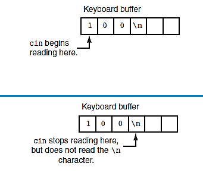
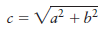

# Chapter 3: Expressions

## `cin` Object

The `cin` object is used for input—it reads data from the keyboard. By contrast, the `cout` object is used for output to the screen. A program typically displays a **prompt** with `cout` to tell the user what data to enter before using `cin`.

The operator `>>` is called the **stream extraction operator**. It directs data **from** the input stream (`cin`) **into** a variable:

```cpp
cin >> length; // Input goes into the variable 'length'

```

-   If the user enters a floating-point value for an integer variable, `cin` will discard everything after the decimal.
    
-   Data typed by the user is stored first in the **keyboard buffer**.
    

> 💡 `#include <iostream>` must be included to use `cin` and `cout`.

## `pow` Function

The `pow` function is part of the C++ standard library (from `<cmath>`) and is used to raise a number to a power.

```cpp
area = pow(4.0, 2.0); // = 16.0

```

-   The values passed to `pow()` are called **arguments**.
    
-   Both arguments and the return value should be of type `double`.
    

### Example Program

```cpp
#include <iostream>
#include <cmath>
using namespace std;

int main() {
    system("color f1");
    const double PI = 3.14159;
    double area, radius;

    cout << "This program calculates area of a circle.\n";
    cout << "What is radius of circle? ";
    cin >> radius;

    area = PI * pow(radius, 2.0);
    cout << "Area is " << area << endl;
    system("pause");
    return 0;
}

```

## Garbage

Garbage refers to memory locations that are allocated but never initialized. It's good practice to **declare only the variables you use**.

```cpp
int width, length;
cout << "Please enter width and length\n";
cin >> width >> length;
cout << "Area of rectangle is\t" << width * length << "\n";

```

## `conio.h` Library Functions

Two commonly used functions from `conio.h`:

### `_getch()`

Reads a character from keyboard without echoing it to the screen.

```cpp
#include <iostream>
#include <conio.h>
using namespace std;

int main() {
    char ex = _getch();
    cout << "Your char is " << ex;
    return 0;
}

```

### `_getche()`

Same as `_getch()` but echoes the character.

```cpp
char ex = _getche();
cout << "\nYour char is " << ex;

```

## Overflow and Underflow

When a variable is assigned a value beyond its valid range:

-   **Overflow**: Too large
    
-   **Underflow**: Too small
    

```cpp
short x = 32767;
x = x + 1; // Overflow
cout << x << endl;

unsigned short y = x - 1; // Underflow
cout << y << endl;

```

> ⚠️Program use incorrect number and produce incorrect results, No warning is issued by the compiler!

## Type Cast

Convert one data type into another:

```cpp
double number = 3.7;
int val = static_cast<int>(number); // val = 3 (truncated)

```

Alternative syntax:

```cpp
int val = int(number);
int val = (int)number;

```

## Multiple and Combined Assignment

Assign the same value to multiple variables:

```cpp
a = b = c = d = 12;

```

Assignment happens right-to-left.

### Combined Assignment Operators

| Operator | Example       | Equivalent        |
|----------|---------------|-------------------|
| `+=`     | `x += 5;`     | `x = x + 5;`      |
| `-=`     | `y -= a * 2;` | `y = y - (a * 2);`|
| `*=`     | `z *= 10;`    | `z = z * 10;`     |
| `/=`     | `a /= b;`     | `a = a / b;`      |
| `%=`     | `c %= 3;`     | `c = c % 3;`      |


## Formatting Output

Use `#include <iomanip>` and `cout` manipulators:

```cpp
#include <iomanip>
int value = 23;
cout << setw(5) << value;

```

### `left` and `right`

```cpp
cout << right << setw(10) << x << endl;
cout << left  << setw(10) << z << endl;

```

### `setprecision`

Control number of total digits:

```cpp
cout << setprecision(5) << z;

```

### `fixed`

Combine with `setprecision` to fix decimal places:

```cpp
double x = 123.4567;
cout << setprecision(2) << fixed << x;

```

### `showpoint`

Forces display of decimal point and trailing zeros:

```cpp
double x = 123.4, y = 456.0;
cout << setprecision(6) << showpoint << x << endl << y;

```


## Working with Characters and String Objects

When using `cin` to read string input, it ignores whitespace characters like spaces and tabs. It starts reading from the first nonblank character and stops when it hits the next whitespace character.

### Solution: `getline()` Function

Use `getline(cin, variable);` to read a full line (including spaces, tabs, and the Enter key `\n`).

```cpp
#include <iostream>
#include <string>
using namespace std;

int main() {
    string name, city;
    cout << "Please enter your name: ";
    getline(cin, name);
    cout << "Enter city you live in: ";
    getline(cin, city);
    cout << "Hello, " << name << endl;
    cout << "You live in " << city << endl;
    return 0;
}

```

## Inputting a Character

### Using `cin >>` Operator

```cpp
char k;
cout << "Type a character and press Enter: ";
cin >> k;

```

### Using `cin.get()`

-   Reads a **single character**, including whitespace.
    
-   Only works with `char` type.
    

```cpp
char ch;
cin.get(ch);

```

### Reading a String with Spaces

```cpp
char arr[10];
cin.get(arr, 8);
cout << arr << endl;

```

Explanation: If you input "wahba mousa", only "wahba m" is stored because it reads up to 7 characters + 1 `\0`.

## Pausing with `cin.get()`

```cpp
char ch;
cout << "This program has paused. Press Enter to continue.";
cin.get(ch);
cout << "It has paused a second time. Press Enter again.";
ch = cin.get();
cout << "It has paused a third time. Press Enter again.";
cin.get();
cout << "Thank you!";

```

## Mixing `cin >>` and `cin.get()`

```cpp
char ch;
int number;
cout << "Enter a number: ";
cin >> number;
cout << "Enter a character: ";
ch = cin.get(); // reads newline left in buffer

```

### Problem

The `cin >>` operation stops reading at the newline (`\n`), which stays in the buffer. `cin.get()` then reads that newline instead of a new character.

## Difference Between `cin`, `get`, and `getline`


cin didn’t read or store newline character (Enter) \n or space so, no problem of putting it after getline or get. but getline reads any space and newline character from keyboard \n and store it  so, it’s a problem to put it after cin or get because it will read \n then  finishes and no problem of putting it before them because it read and store \n. get read any space and newline \n like getline but didn’t store newline so, it’s problem to put it after cin because it will read \n of cin or before getline because getline will read its \n and finish.

```cpp
char str1[10], str2[100], y;

cin >> y; // H

cin.get(str2, 100); // it read \n (enter from keyboard) and finished but didn’t store it, str2 value is \n (0).

cin.getline(str1, 10); //it read and store \n and finish but \n doesn’t exist, str1 value is \n (0).

cout << y <<str1 <<str2; //h
```

**But in next case we can replace newline** \n **character with a character from your choice:**

```cpp
char str1[10], str2[100], str3[10], str4[100], str5[10];

cin.getline(str1, 10, 'h'); // WahbaMousa. getline will read and store it until ‘h’ then finishes without printing h.

cin.get(str2, 100, 'a'); // get will read and store what after h until a without printing a or h.

cin.getline(str3, 10, 'u'); // getline will read and store a of last get until ‘u’ and print a.

cin.get(str4, 100, 'a'); // get will read and store what after u until a without printing a.

cin.getline(str5, 10);  // will read remains character + last one of get and store it.

cout << str1 << "\n" <<str2<<"\n"<<str3<<"\n"<<str4<<"\n"<<str5; //Wa-b-aMo -s-a.
```

## Skipping Buffer with `cin.ignore()`

To solve last problem, use cin object’s member function ignore after cin >> statement. it tells cin object to skip one or more characters in keyboard buffer:  
 ```cpp 
 cin. ignore (n, c); 
 
 ``` 
 arguments in parentheses are optional, n is int and c is char. they tell cin to skip n number of c character, or until character c is encountered:

```cpp
cin.ignore(); // skips 1 character (default)
cin.ignore(10, '\n'); // skips up to 10 or until '\n'

```

### Example

```cpp
char ch;
int number;
cout << "Enter a number: ";
cin >> number;
cin.ignore();
cout << "Enter a character: ";
ch = cin.get();
cout << "Thank You!\n";

```

 


## String Member Functions and Operators

To get the length of a string stored in a string object, use the `.length()` member function:

```cpp
string state = "Texas";
int size = state.length(); // size = 5
cout << state.length();    // or just cout << size;

```

### String Concatenation Using `+` Operator

You can join two strings using the `+` operator:

```cpp
#include <iostream>
using namespace std;

int main() {
    string greeting1 = "Hello ";
    string name1 = "World";
    string greeting2 = greeting1 + name1;

    string name2 = "People";
    greeting1 = greeting1 + name2; // same as greeting1 += name2

    cout << greeting2 << endl << greeting1 << endl;
    cout << "\n Hello:       " << "World \n";
    return 0;
}

```

> Make sure there's a space if you want separation between concatenated strings.

## Mathematical Library Functions

These functions are available from the `<cmath>` header file:

| Function | Example         | Description                                                                 |
|----------|------------------|-----------------------------------------------------------------------------|
| `abs`    | `y = abs(x);`    | Returns absolute value of `x`. Argument and return type are `int`.          |
| `cos`    | `y = cos(x);`    | Returns cosine of angle in radians. Argument and return type are `double`.  |
| `exp`    | `y = exp(x);`    | Returns `e^x`. Argument and return type are `double`.                        |
| `fmod`   | `y = fmod(x, z);`| Returns remainder of `x/z` as a `double`. Use instead of `%` for `double`.  |
| `log`    | `y = log(x);`    | Returns natural logarithm of `x`. Argument and return type are `double`.    |
| `log10`  | `y = log10(x);`  | Returns base-10 logarithm of `x`. Argument and return type are `double`.    |
| `sin`    | `y = sin(x);`    | Returns sine of angle in radians. Argument and return type are `double`.    |
| `sqrt`   | `y = sqrt(x);`   | Returns square root of `x`. Argument and return type are `double`.          |
| `tan`    | `y = tan(x);`    | Returns tangent of angle in radians. Argument and return type are `double`. |


### Example Program (Hypotenuse Calculation)   

```cpp
#include <iostream>
#include <iomanip>
#include <cmath>
using namespace std;

int main() {
    double a, b, c;
    cout << "Enter length of side a: ";
    cin >> a;
    cout << "Enter length of side b: ";
    cin >> b;

    c = sqrt(pow(a, 2.0) + pow(b, 2.0));
    cout << "Length of hypotenuse is " << setprecision(2) << c << endl;
    return 0;
}

```

## Increment and Decrement Operators

To increase or decrease a variable by 1:

```cpp
num = num + 1;
num += 1;
num++;
++num;

```

Similarly, to decrease:

```cpp
num = num - 1;
num -= 1;
num--;
--num;

```

### Prefix vs Postfix

```cpp
int num = 4;
cout << num++; // outputs 4, then increments to 5 (postfix)
cout << ++num; // increments first, then outputs 6 (prefix)

```

### In Expressions

```cpp
int a = 2, b = 5, c;
c = a * b++;
// c = 2 * 5 = 10, then b becomes 6

```

But:

```cpp
c = a * ++b; // b becomes 6 first, then c = 2 * 6 = 12

```

> ⚠️ `++(a * b);` is invalid. `++` must operate on a variable.

### In Relational Expressions

```cpp
int x = 10;
if (x++ > 10) // false: condition checks x first, then increments
if (++x > 10) // true: x is incremented before comparison

```

## Random Numbers

C++ provides `rand()` in `<cstdlib>` to generate random numbers.

```cpp
int y = rand(); // generates pseudo-random integer

```

To change the sequence every time, use `srand()` with `time()` from `<ctime>`:

```cpp
#include <cstdlib>
#include <ctime>

unsigned seed = time(0);
srand(seed);

```

### Limiting a Random Range

```cpp
int y = (rand() % (maxValue - minValue + 1)) + minValue;

```

### Program: Dice Rolling Simulation

```cpp
#include <iostream>
#include <cstdlib>
#include <ctime>
using namespace std;

int main() {
    const int MIN_VALUE = 1, MAX_VALUE = 6;
    int dice1, dice2;
    srand(time(0));

    cout << "Rolling dice...\n";
    dice1 = (rand() % (MAX_VALUE - MIN_VALUE + 1)) + MIN_VALUE;
    dice2 = (rand() % (MAX_VALUE - MIN_VALUE + 1)) + MIN_VALUE;

    cout << dice1 << endl << dice2 << endl;
    return 0;
}

```

### Measuring Execution Time

```cpp
#include <ctime>
#include <iostream>
using namespace std;

int main() {
    int x = time(0);
    for (int i = 0; i < 2000; i++) {
        cout << time(0) << endl;
    }
    int y = time(0);
    cout << "Time taken in process: " << (y - x) << " seconds" << endl;
    return 0;
}

```

## Hand Tracing a Program

This is the process of manually stepping through a program’s logic to verify expected results and catch logic errors before runtime.

----------

**Notes:**

## Constants

```cpp
#define PI 3.14

```

-   Must appear **before** `main()`
    
-   No `;`, `=`, or type
    
-   Not preferred in modern C++—use `const` instead
    

> ✅ Use `const double PI = 3.14;` instead for type safety and scoping

## About `#include<iostream.h>`

This is an outdated syntax. It is equivalent to:

```cpp
#include <iostream>
using namespace std;

```

But `#include<iostream.h>` may not be supported in modern compilers like Visual Studio.

----------

